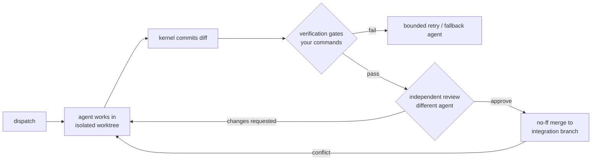
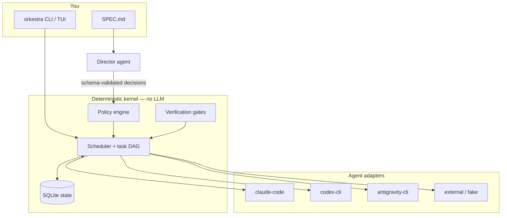

# Orkestra

> **Coordinate many agents. Deliver one verified result.**

You already use coding agents — Claude Code, OpenAI Codex, Google
Antigravity. Orkestra makes **two or more of them work on the same
project at once**, safely: every task runs in its own isolated Git
worktree, your test commands are the referee, and nothing lands until a
*different* agent has reviewed it. Your branches are never touched;
finished work waits on a side branch until you accept it.

## See it in 60 seconds — free

```bash
uv tool install 'orkestra-runtime[tui]'
orkestra demo
```

No agent CLIs, no logins, no tokens spent — scripted fake agents drive
the *real* engine so you can watch the whole lifecycle:

```text
▸ The plan: two independent tasks run in PARALLEL, each in its own
  isolated Git worktree, then a third task builds on both.
  completed verification passed: PASS (exit 0): test -f feature_a.py
  completed review by grace: changes requested (severity medium)
    warning review requested changes (cycle 1)
  completed review by grace: approved (severity none)
  completed task feature-a done (agent ada)
  completed all tasks done
▸ Done: 3 tasks planned, isolated, verified, cross-reviewed, integrated.
  1 review rejection triggered a repair loop (bounded — never spins forever).
```

That rejection-then-repair is the point: agents check each other, the
kernel keeps score, and you only see verified results.

## Use it on your project

One guided command sets up everything — your agents, a quality preset,
models and effort, the verification gate, even your spec:

```bash
cd my-project
orkestra start         # answers a few questions, then (optionally) runs
```

Pick a preset — **Faster**, **Balanced (recommended)**, **Maximum
quality** (which fields two Claude profiles, `claude-deep` + a fast
sidekick, alongside Codex and Antigravity at high effort) — or go Custom
and choose models per agent from live-discovered lists. If fewer than
two agent CLIs are signed in, `start` sets up **practice mode** with
built-in fake agents so the journey works on any machine, free.

Prefer the granular commands? They all still exist:

```bash
orkestra init . && orkestra doctor && orkestra run --watch
orkestra models                       # your lineup: model, effort, provenance
orkestra agents set claude --model sonnet --effort auto
```

While it runs: `orkestra watch` (live dashboard from any terminal),
`orkestra status`, `orkestra pause` / `resume` / `cancel` — state
survives crashes, Ctrl-C, and reboots.

When it finishes:

```bash
orkestra review        # what was built: status, checks, changes
orkestra accept        # bring it into your branch — asks before touching anything
```

(`orkestra diff` and `orkestra merge` remain as advanced aliases.)

If Orkestra needs you (budgets exhausted, a real decision), it stops
and explains itself in plain language:

```bash
orkestra decisions     # what happened, what it means, what to try
orkestra approve       # picks the open decision, prompts you, done
orkestra resume
```

Effort is provider-neutral (`auto | low | medium | high | max`) and
validated against what each CLI genuinely supports — unsupported levels
are rejected with an explanation, never silently ignored.

## Supported agents

| Agent | Adapter | Notes |
|---|---|---|
| Claude Code | `claude-code` | Default director; structured output |
| OpenAI Codex CLI | `codex-cli` | OS-level sandbox; effort tuning |
| Google Antigravity CLI (`agy`) | `antigravity-cli` | Consumer-account Google adapter; effort tuning |
| Google Gemini CLI | `gemini-cli` | API-key / Vertex / Enterprise auth only¹ |
| Anything else | `external` | One small [JSONL protocol](docs/adapters/PROTOCOL.md), any language |
| Scripted fake | `fake` | Powers the demo, tests, offline mode |

¹ Google moved individual-consumer OAuth to the Antigravity suite in
June 2026, so `antigravity-cli` is the default Google adapter.

Two agents minimum, no upper bound, no fixed roles: a **director agent**
(default Claude Code, configurable) plans and delegates from measured
evidence — including to itself.

## What you can rely on

| Guarantee | How |
|---|---|
| Your branches are never modified | agents work in isolation; `orkestra accept` is the only step that touches your branch, it always asks first, and it refuses incomplete runs |
| Agents can't approve their own work | kernel-enforced implementer ≠ reviewer, across vendors |
| "Tests pass" claims mean nothing | the kernel runs *your* `[verify]` commands and reads exit codes itself — plan-proposed checks can only be added on top, after validation, never substituted |
| No surprise costs | per-agent token budgets, rate-limit-aware scheduling, live progress/cost line, everything bounded |
| Crashes lose nothing | SQLite state + idempotent transitions; `orkestra resume` reconciles and continues |
| Secrets stay out of logs | credential-shape redaction on everything persisted or exported |
| Your credentials are untouched | agents sign in through their own official CLIs; Orkestra never reads token stores |

Elevated modes exist, are loudly named (`autonomy = "unsafe-full"`), and
are never defaults. Details: [docs/SECURITY_MODEL.md](docs/SECURITY_MODEL.md).

## How it works (the part for skeptics)

Most multi-agent tools hard-code roles or put an LLM in charge of
everything. Orkestra separates powers: intelligence proposes,
determinism disposes.

- The **director agent** analyzes your spec, measures the available
  agents with objective probes, decomposes the work into a dependency
  graph, and proposes assignments — as schema-validated JSON, never
  free prose.
- The **deterministic kernel** (plain Python, no LLM) validates every
  proposal against policy, owns all state, dispatches work, enforces
  review independence, runs verification gates, and integrates results.
- Delegation is **evidence-based**: probe results and every task
  outcome land in a ledger; assignments re-rank as evidence accumulates.
  Scores without recorded evidence don't exist.





More diagrams (lifecycle, capability discovery, human gates):
[docs/CONCEPTS.md](docs/CONCEPTS.md) and
[docs/architecture/ARCHITECTURE.md](docs/architecture/ARCHITECTURE.md).

## Verified vs. experimental

**Verified** — 472 tests plus live cross-vendor runs with real Claude
Code / Codex / Antigravity CLIs (including a gate-caught silent failure,
automatic fallback repair, and cross-vendor review approvals), and
dogfooding: Orkestra reviewed its own code, and that review's findings
shipped as v0.1.1.

**Experimental / limits** — Antigravity's JSON output flag is
undocumented upstream (adapter has a plain-text fallback); Gemini CLI is
auth-limited by Google's consumer migration; the Docker sandbox covers
external/fake agents only (vendor CLIs would need your credential
stores mounted — refused, see ADR-0009); Windows untested. Providers'
plan limits are yours: see [docs/PROVIDERS.md](docs/PROVIDERS.md),
including a disclosed gray area in Antigravity's ToS.

## Docs

[Install](docs/INSTALL.md) · [Quickstart](docs/QUICKSTART.md) ·
[Concepts](docs/CONCEPTS.md) · [Configuration](docs/CONFIGURATION.md) ·
[CLI](docs/CLI.md) · [Troubleshooting](docs/TROUBLESHOOTING.md) ·
[FAQ](docs/FAQ.md) · [Adapter protocol](docs/adapters/PROTOCOL.md) ·
[Security model](docs/SECURITY_MODEL.md) ·
[Threat model](docs/security/THREAT_MODEL.md) · [Roadmap](ROADMAP.md)

Contributing: [CONTRIBUTING.md](CONTRIBUTING.md) — kernel stays
deterministic, no fixed-agent-count assumptions, evidence over
self-report.

## License

Apache-2.0 — [LICENSE](LICENSE), [NOTICE](NOTICE).

Claude is a trademark of Anthropic PBC; Codex and ChatGPT of OpenAI;
Gemini and Antigravity of Google LLC. Orkestra is independent and not
affiliated with or endorsed by any of them.
