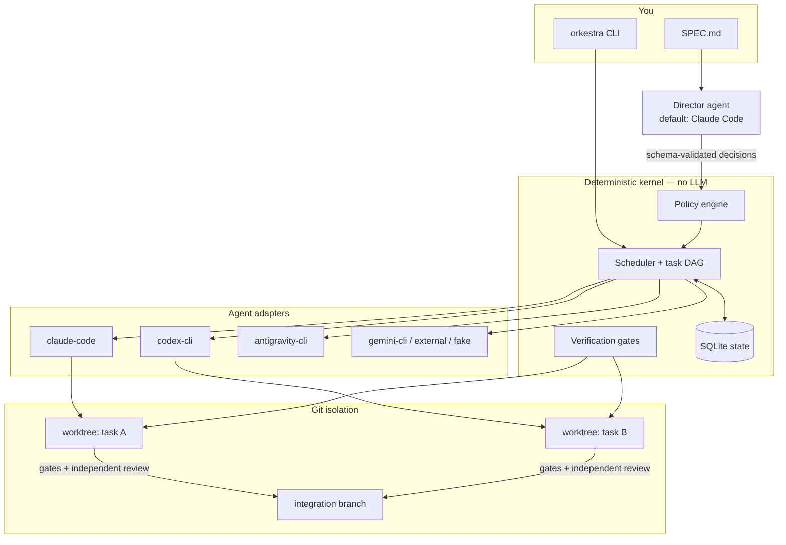
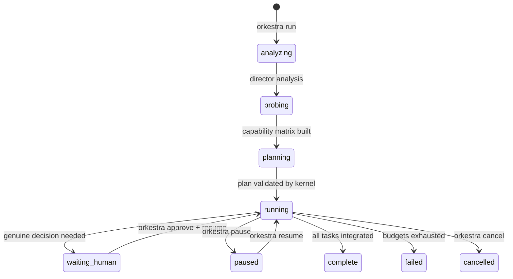
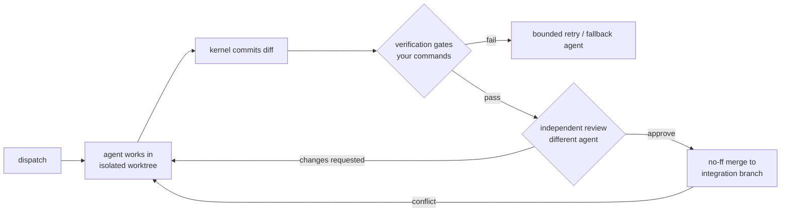
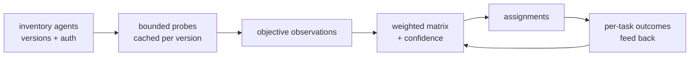
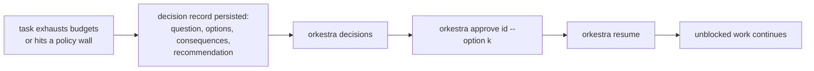

# Orkestra

> **Coordinate many agents. Deliver one verified result.**

Orkestra is an open-source, **local-first orchestration runtime** that lets
two or more autonomous coding agents — Claude Code, OpenAI Codex CLI,
Google Antigravity CLI, Gemini CLI, or your own — collaborate on the same
software project with minimal human intervention.

It exists because running several subscription-authenticated agent CLIs by
hand means juggling terminals, praying nobody clobbers anybody's edits, and
trusting an LLM's word that "all tests pass." Orkestra replaces that with a
**deterministic kernel** that isolates every task in its own Git worktree,
runs your acceptance commands itself, and requires an **independent agent
review** before anything is integrated.

## Why it's different

Most multi-agent tools hard-code roles ("Claude implements, X reviews") or
put an LLM in charge of everything. Orkestra separates powers:

- A **director agent** (default: Claude Code — configurable) analyzes your
  project, measures the available agents with bounded capability probes,
  decomposes the work into a dependency graph, and proposes assignments.
- A **deterministic, non-LLM kernel** validates every director decision
  against schemas and policy, owns all state, dispatches work, enforces
  `implementer ≠ reviewer`, runs verification gates, and integrates
  results. Agents *propose*; the kernel *disposes*.
- Delegation is **evidence-based and adaptive**: every probe result and
  task outcome lands in a capability ledger; assignments re-rank as
  evidence accumulates. Scores without recorded evidence don't exist.



## Supported agents

| Agent | Adapter | Notes |
|---|---|---|
| Claude Code | `claude-code` | Default director; structured output via `--json-schema` |
| OpenAI Codex CLI | `codex-cli` | OS-level sandbox (Seatbelt/Landlock); `--output-schema` |
| Google Antigravity CLI (`agy`) | `antigravity-cli` | First-party Google adapter for consumer accounts |
| Google Gemini CLI | `gemini-cli` | For API-key / Vertex / Enterprise auth only¹ |
| Anything else | `external` | Speak the [`orkestra-jsonl/1` protocol](docs/adapters/PROTOCOL.md) |
| Scripted fake | `fake` | Deterministic; used by tests and offline mode |

¹ Google migrated individual-consumer OAuth off the Gemini CLI to the
Antigravity suite in June 2026; Orkestra's default Google adapter is
therefore `antigravity-cli`.

Two agents are the minimum; there is no upper bound and no fixed-three
assumption anywhere in the schema, scheduler, or tests.

## Install

Requires Python ≥ 3.12, Git, and at least two agent CLIs installed and
signed in (their own official login flows — Orkestra never touches your
credentials).

```bash
# with uv (recommended)
uv tool install git+https://github.com/andyyaro/orkestra
# or with pip
pip install git+https://github.com/andyyaro/orkestra
```

## Quickstart (two agents)

```bash
cd my-project                 # existing repo or empty directory
orkestra init .               # writes .orkestra/config.toml + SPEC.md
$EDITOR SPEC.md               # describe what you want built
$EDITOR .orkestra/config.toml # enable ≥2 agents; set verify commands
orkestra doctor               # check agents, auth, git readiness
orkestra run                  # analyze → probe → plan → execute → report
```

While it runs (or afterwards):

```bash
orkestra status        # task graph state
orkestra logs          # streamed, redacted event log
orkestra decisions     # questions only a human can answer
orkestra approve dec_x --option retry
orkestra pause / resume / cancel
orkestra report --out report.md
```

Results accumulate on a dedicated branch `ork/<run>/integration` — your
branches are never touched. Merge it when you're satisfied:

```bash
git merge ork/run_xxxx/integration
```

## The lifecycle



Each task moves through a pipeline the implementing agent cannot skip:



### Capability discovery



Probes are budgeted, cached per agent version, and can be disabled
(`probes.mode = "off"`). Every matrix score carries the observation ids
behind it.

### Human gates



Independent tasks keep running while a decision is open; state survives
closing the terminal, crashes, and reboots (SQLite + idempotent
transitions).

## Safety model

| Guarantee | Mechanism |
|---|---|
| Your branches are never modified | all work on `ork/*` branches; integration is opt-in merge |
| Agents can't approve their own work | kernel-enforced `implementer ≠ reviewer` |
| "Tests pass" claims are worthless | the kernel re-runs your acceptance commands and reads exit codes |
| No shell injection | argv-only subprocess execution everywhere; generated branch names |
| Git hooks can't attack the orchestrator | Orkestra's own git runs hook-disabled; diffs touching hooks/`.git`/workflows are rejected |
| Secrets stay out of logs | credential-shaped redaction at write time and export time |
| No credential access | agents authenticate through their own official CLIs; Orkestra never reads token stores |
| No surprise costs | no pushes, no deploys, no purchases; rate-limit signals are hard backpressure; bounded retries everywhere |

Elevated modes exist but are explicit and loudly named
(`autonomy = "unsafe-full"` per agent). Full details:
[docs/SECURITY_MODEL.md](docs/SECURITY_MODEL.md) and
[docs/security/THREAT_MODEL.md](docs/security/THREAT_MODEL.md).

## Status: verified vs. experimental

**Verified** (unit + integration + E2E tested, and live-smoke-tested with
real Claude Code / Codex / Antigravity CLIs): worktree isolation, the
verification/review pipeline, crash recovery and resume, human gates,
capability probes and evidence-based assignment, all five adapters'
parsers against captured CLI output.

**Experimental / known limits**: Antigravity's `--output-format` flag is
undocumented upstream and may drift (the adapter falls back to plain
text); Gemini CLI adapter is auth-limited by Google's consumer migration;
Docker sandboxing and a TUI are roadmap items (`ROADMAP.md`); Windows is
untested.

**Provider terms**: you run agents under your own subscriptions and their
own limits — see [docs/PROVIDERS.md](docs/PROVIDERS.md) for the terms
review, including an unresolved gray area in Google's Antigravity ToS
regarding third-party tools; review your providers' terms yourself.

## Extending

Add any agent as an external command speaking a small JSONL protocol —
[docs/adapters/PROTOCOL.md](docs/adapters/PROTOCOL.md) — and validate it
with the built-in contract test kit. Built-in adapter contributions:
[docs/adapters/AUTHORING.md](docs/adapters/AUTHORING.md).

## Contributing

See [CONTRIBUTING.md](CONTRIBUTING.md). Ground rules: the kernel stays
deterministic, no fixed-agent-count assumptions, evidence over
self-report. Quality gates: ruff, mypy `--strict`, bandit, pytest with
coverage ≥ 80%.

## Documentation

- [Installation](docs/INSTALL.md) · [Quickstart](docs/QUICKSTART.md) ·
  [Concepts](docs/CONCEPTS.md) · [Configuration](docs/CONFIGURATION.md) ·
  [CLI reference](docs/CLI.md)
- [Architecture](docs/architecture/ARCHITECTURE.md) ·
  [ADRs](docs/architecture/adr/) ·
  [Threat model](docs/security/THREAT_MODEL.md)
- [Troubleshooting](docs/TROUBLESHOOTING.md) · [FAQ](docs/FAQ.md) ·
  [Provider terms](docs/PROVIDERS.md) · [Roadmap](ROADMAP.md)

## License

Apache-2.0 — see [LICENSE](LICENSE) and [NOTICE](NOTICE).

Claude is a trademark of Anthropic PBC; Codex and ChatGPT are trademarks
of OpenAI; Gemini and Antigravity are trademarks of Google LLC. Orkestra
is an independent project, not affiliated with or endorsed by Anthropic,
OpenAI, or Google.
