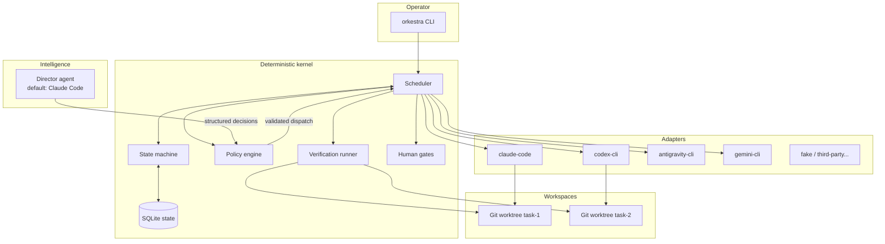
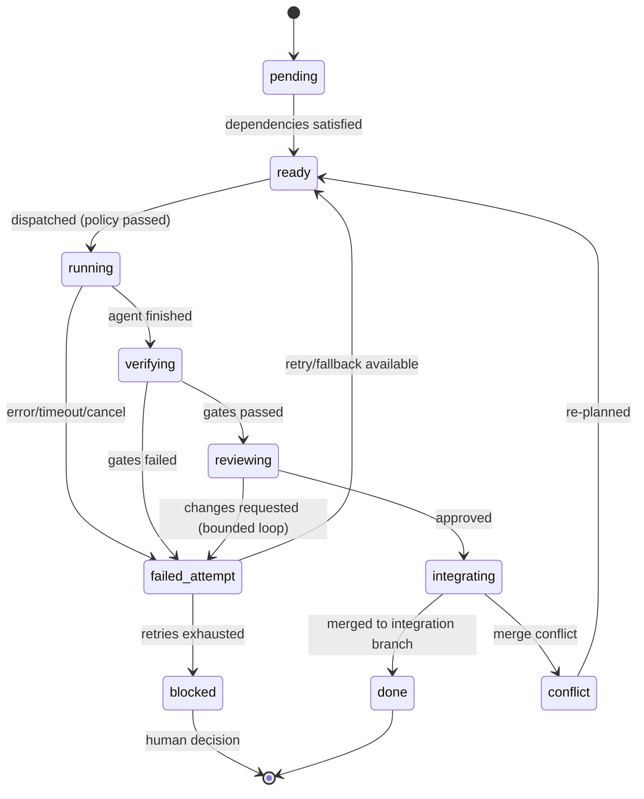
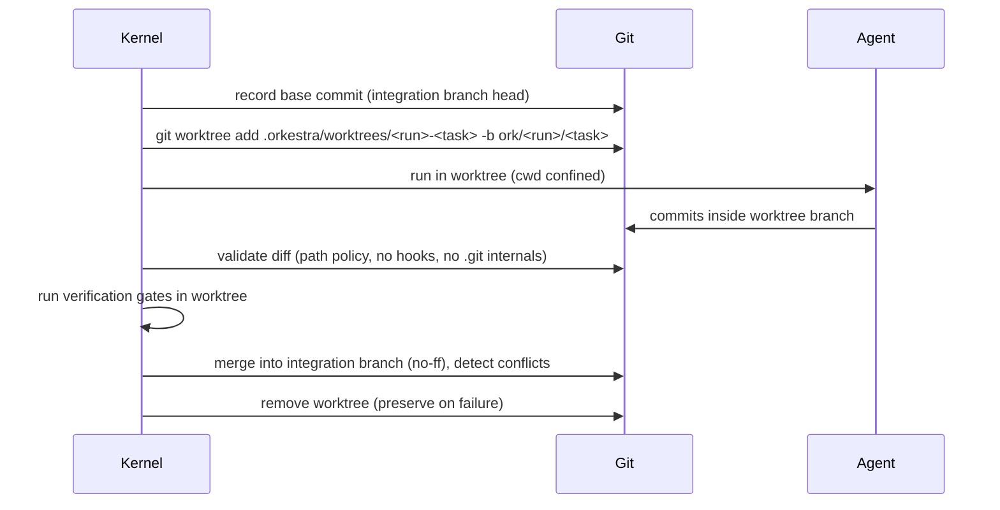
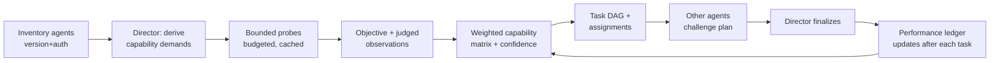

# Orkestra Architecture

Status: authoritative design (written at v0.1; adapters and CLI
surface have since grown - the adapter table below and docs/CLI.md are
kept current). See `adr/` for individual decisions.

## Overview

Orkestra separates **intelligence** from **authority**:

- A configurable **director agent** (default: Claude Code) analyzes the
  project, evaluates the available agents, decomposes work, and recommends
  assignments - always as structured, schema-validated decisions.
- A deterministic **orchestration kernel** (plain Python, no LLM) owns all
  authority: state transitions, scheduling, process lifecycle, workspace
  isolation, policy, verification gates, review separation, human gates,
  and completion.



## Package layout

```text
src/orkestra/
    kernel/          # state machine, scheduler, DAG, retry, events
    store/           # SQLite persistence, migrations, repositories
    adapters/        # base contract, process runner, first-party adapters
    workspace/       # git validation, worktree lifecycle, integration
    director/        # director protocol, prompts, decision schemas
    capabilities/    # probes, observations, matrix, performance ledger
    policy/          # policy model, evaluation, redaction
    verify/          # deterministic verification runner
    cli/             # Typer command surface
    schemas/         # versioned Pydantic models (contracts)
    report/          # status, final report, JSON export, support bundle
```

Dependency rule: `cli → kernel → (store, adapters, workspace, policy,
verify, capabilities)`; `director` talks to the kernel only through
`schemas`. Nothing imports `cli`. Adapters never import the kernel.

## Core concepts

### Deterministic kernel

The kernel is an async single-writer event loop over persistent state:

1. Load project run state from SQLite.
2. Compute the ready frontier of the task DAG.
3. For each ready task, evaluate policy, acquire a workspace, dispatch to
   the assigned adapter with a rendered task brief.
4. Consume the adapter's normalized event stream; persist events.
5. On completion, run deterministic verification in the workspace: the
   user's `[verify]` commands (authoritative) plus any plan-proposed
   acceptance commands that pass validation.
6. Route to review (independent reviewer ≠ implementer), then integration.
7. Record outcomes in the performance ledger; ask the director for
   reassignment recommendations when policy triggers allow.
8. Repeat until terminal state (complete, failed, cancelled, or waiting on
   a human decision).

Every transition is transactional and idempotent; the kernel can be killed
at any point and resumed.

### Task lifecycle



### Adapter contract

Adapters are pure translators: Orkestra task brief → CLI invocation →
normalized event stream → structured `AgentResult`. The contract (see
`adapters/base.py`) covers detection, version, auth readiness, feature
flags, invocation, streaming, cancellation, timeout, session resumption,
usage metadata, and error normalization into a closed error taxonomy
(`none`, `auth`, `rate_limit`, `timeout`, `cancelled`, `crash`,
`invalid_output`, `policy`, `unavailable`, `unknown`).

First-party adapters and their invocation surfaces (verified against
installed CLIs, 2026-07-24):

| Adapter | Invocation | Streaming | Result |
|---|---|---|---|
| `claude-code` | `claude -p --output-format stream-json --permission-mode ...` | JSONL events | terminal `type:"result"` object |
| `codex-cli` | `codex exec --json -C <dir> --sandbox workspace-write` | JSONL (`thread.*`, `item.*`, `turn.*`) | `item.completed agent_message` + `turn.completed` usage |
| `antigravity-cli` | `agy -p --output-format stream-json --mode accept-edits` | JSONL (`init`, `step_update`) | terminal `result` event (`conversation_id`, `status`, `response`, usage) |
| `gemini-cli` (non-default; API-key/Vertex auth only) | `gemini -p -o stream-json --approval-mode ...` | JSONL | final JSON; auth errors: exit 41 + JSON on stderr |
| `fake` | scripted subprocess or in-process script | synthetic | deterministic, for tests |

Note: Google retired individual-consumer OAuth on the legacy `gemini`
CLI in favor of the Antigravity suite (`agy`); `antigravity-cli` is the
first-party Google adapter, `gemini-cli` remains supported for API-key /
Vertex / Standard-Enterprise authentication.

### Workspace isolation

Every mutable task gets a dedicated worktree:



Orkestra's own Git commands always run with hooks disabled
(`-c core.hooksPath=`) and argument-array execution.

### Capability discovery



Probe results are cached keyed by (adapter, version, probe id). Budgets and
offline mode prevent quota waste. Scores without recorded evidence are
forbidden - the matrix stores the observation ids behind every score.

### Human gates

The kernel pauses a decision-bearing path (not the whole run when
avoidable), persists a `HumanDecision` record (question, why, options,
consequences, recommendation, unblocked work), and surfaces it via
`orkestra decisions` / `orkestra approve`. `orkestra resume` continues.

## Persistence

SQLite (WAL mode) at `.orkestra/orkestra.db`, accessed through a thin
repository layer with explicit SQL and a linear, versioned migration
chain (`schema_version` table). Payloads are versioned JSON documents
validated by Pydantic on read and write. Event log is append-only
(`events` table) and drives `orkestra logs` and the final report.

Rationale for plain SQL over an ORM: the schema is small (~15 tables),
migrations must be auditable, and removing SQLAlchemy/Alembic cuts two
heavyweight dependencies (ADR-0003).

## Concurrency model

A single `asyncio` process. One kernel writer task owns all state
mutation; agent subprocesses run concurrently under a semaphore
(`max_concurrency`). Cancellation propagates by terminating process
groups (SIGTERM, grace period, SIGKILL). Timeouts are enforced by the
runner, not trusted to agents.

## Safety defaults

- Agents run with their own safety systems in workspace-scoped modes
  (Claude: `--permission-mode acceptEdits` + `--add-dir` confinement;
  Codex: `--sandbox workspace-write`; Antigravity: `--mode accept-edits`;
  Gemini: `--approval-mode auto_edit`).
- Full-autonomy per-agent modes are opt-in via explicitly named
  `agents.<name>.autonomy = "unsafe-full"` config, logged loudly.
- No pushes, no deployment, no network changes by Orkestra itself.
- Policy engine evaluates every dispatch and every integration.

## Extension

Third-party adapters are declared in config with a manifest (name,
command, protocol version, capabilities). A contract test kit
(`orkestra.adapters.testkit`) runs any adapter against golden scenarios:
detection, happy path, timeout, cancellation, garbage output, non-zero
exit. No dynamic code loading in v0.1 (ADR-0006).
